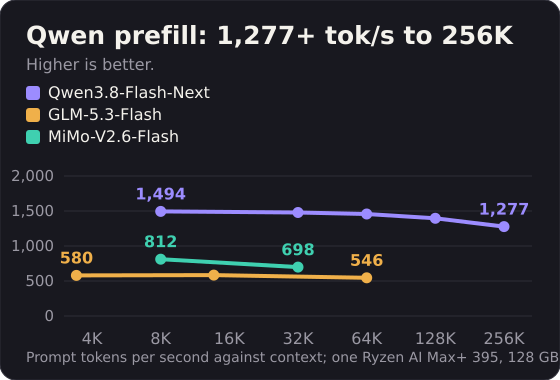
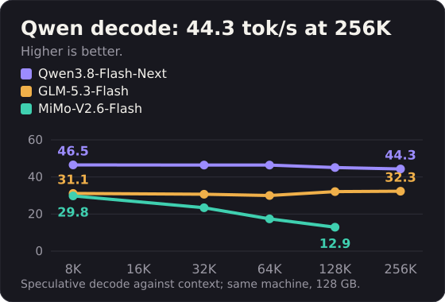

<p align="center"></p>

<h1 align="center">Kyojin</h1>
<p align="center"><b>Large language models on an AMD Strix Halo mini PC.</b><br>
An inference engine built on <a href="https://github.com/turboderp-org/exllamav3">ExLlamaV3</a>, with speculative decoding, for 100 GB-class models in 128 GB.</p>

<p align="center">
<a href="LICENSE"></a>


<a href="https://huggingface.co/yamz-labs"></a>
<a href="https://x.com/YamzLabs"></a>
</p>

<table align="center">
<tr><th align="left">Model</th><th>Pack</th><th>Prefill</th><th>Speculative decode</th></tr>
<tr><td><b>Qwen3.8-Flash-Next</b></td><td align="right">95 GB</td><td align="right">1481 at 8K</td><td align="right"><b>45.7 to 66.8</b></td></tr>
<tr><td><b>GLM-5.3-Flash</b></td><td align="right">99.73 GB</td><td align="right">634 at 8K</td><td align="right"><b>26.2 to 33.4</b></td></tr>
<tr><td><b>MiMo-V2.6-Flash</b></td><td align="right">105.8 GB</td><td align="right">760 at 8K</td><td align="right"><b>28.9 to 37.0</b></td></tr>
</table>

<p align="center"><sub>Tokens per second on one Ryzen AI Max+ 395 with 128 GB. Prefill at the context shown in each cell, speculative decode across chat, prose and code prompts. Method, sources and full tables: <a href="doc/benchmarks.md">doc/benchmarks.md</a>.</sub></p>

<p align="center">


</p>

**Uncensored mode.** Each model has an optional mode that makes it refuse far less. The engine applies it at load and the weights stay untouched: ready-made packs for [GLM-5.3-Flash](https://huggingface.co/yamz-labs/GLM-5.3-Flash-EXL3-Yamz-Uncensored) and [MiMo-V2.6-Flash](https://huggingface.co/yamz-labs/MiMo-V2.6-Flash-MOPD-EXL3-Yamz-Uncensored), and a preset inside the [Qwen3.8-Flash-Next pack](https://huggingface.co/yamz-labs/Qwen3.8-Flash-Next-EXL3-Yamz) that is off by default. How it works: [doc/refusal_hook.md](doc/refusal_hook.md).

These are first versions. Speed, context length and model support keep improving.

## Contributors

Thank you to everyone who tests Kyojin on their own machine and writes precise reports.

- [@felladrin](https://github.com/felladrin): pull requests for the GLM start-up, the GPU target lookup, the bench tool tests, the troubleshooting page, `--sessions` in the Qwen server and `tools/bench.sh --json`; bug reports, an independent benchmark and issue triage.
- [@nobert](https://github.com/nobert): the Prometheus `/metrics` endpoint, merged for GLM and MiMo.
- [@morrisfamily](https://github.com/morrisfamily): benchmark report on a BOSGAME Beyond-Max.
- [@ChrisC381](https://github.com/ChrisC381): reported the GLM difference between paired jobs.
- [@dturini12](https://github.com/dturini12): reported streaming without `finish_reason`; fixed and confirmed.
- [@mostlygeek](https://github.com/mostlygeek): proposal for a container setup.

## Quickstart

Install ROCm torch and build once ([doc/install.md](doc/install.md)), then:

```bash
git clone https://github.com/Yamz-Labs/kyojin && cd kyojin
hf download yamz-labs/Qwen3.8-Flash-Next-EXL3-Yamz --local-dir ./qwen-pack
python tools/qwen/serve.py --model ./qwen-pack --port 8000 -c 131072
```

The server speaks the OpenAI API on port 8000. GLM and MiMo commands: [doc/models.md](doc/models.md).

## Read more

- [Install and first launch](doc/install.md): requirements, build, per-shell setup, first-launch tuning
- [Models](doc/models.md): Qwen, GLM and MiMo weights, serve commands, options
- [Benchmarks](doc/benchmarks.md): how the figures are measured, where each comes from, full tables, share yours with `tools/bench.sh`
- [Troubleshooting](doc/troubleshooting.md), [refusal hook](doc/refusal_hook.md), [development](doc/development.md), [credits and licence](doc/credits.md)

Reports and pull requests are welcome: see [CONTRIBUTING.md](CONTRIBUTING.md). Kernel notes: [README.strix-halo.md](README.strix-halo.md). Upstream guide: [README.upstream.md](README.upstream.md).

MIT licence. Built on [ExLlamaV3](https://github.com/turboderp-org/exllamav3) by turboderp, with the first AMD ports by [vcruz305](https://github.com/vcruz305/exllamav3-amd) and [sdougbrown](https://github.com/sdougbrown/exllamav3): [full credits](doc/credits.md). News: [@YamzLabs on X](https://x.com/YamzLabs).
