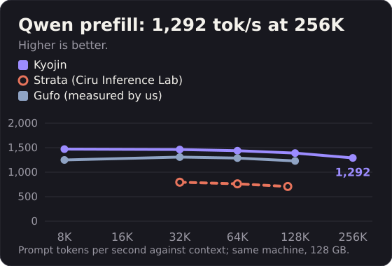
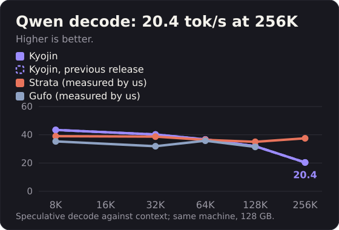

# Benchmarks

## How these figures are measured

One machine: Ryzen AI Max+ 395, Radeon 8060S (gfx1151), 128 GB LPDDR5X, ROCm. Other GPUs are untested.

The Qwen and MiMo figures on the front page come from a run set up like yours (GLM: see below):

- the public code at the commit named in `doc/figures.json`, built from the README install;
- an empty home directory, the published packs downloaded from the hub, the default environment (no private flags);
- greedy decoding, thinking off, the four card prompts for each of chat, prose and code, 256 tokens, median of 3 repetitions (`tools/bench.sh` runs the same prompts);
- prefill and decode by context: cold prompts of 8K and 32K tokens (Qwen also 64K, 128K, 256K), a long essay request; prefill is the engine-reported prompt speed, decode the speculative decode speed over the reply. GLM and MiMo: median of 3 requests after a warm-up request, speed from the server timing; Qwen: one request per depth, essay of 256 tokens;
- speculative decode is the default server mode and returns the same tokens as plain decode.
- the server log of each run has no `fallback`, `disabled`, `unavailable`, `not tuned` or `No module` line.

## Qwen3.8-Flash-Next and MiMo-V2.6-Flash

Tokens per second; prefill by context, speculative decode by kind of text.

| Model | Pack | Prefill 8K | Prefill 32K | Prefill 64K | Prefill 128K | Prefill 256K | Spec prose | Spec chat | Spec code |
|---|---|---|---|---|---|---|---|---|---|
| Qwen3.8-Flash-Next | 95 GB | 1471 | 1463 | 1439 | 1390 | 1292 | 45.7 | 48.6 | 61.0 |
| MiMo-V2.6-Flash | 105.8 GB | 812 | 698 | - | - | - | 29.1 | 32.4 | 38.9 |

## GLM-5.3-Flash

The GLM figures were published before this page and are quoted as published (99.7 GB pack, MTP with 2 drafts, `-c 98304`, hook on with the agent-lane server flags, prefill mean of 3, decode mean of 6, temperature 0):

| Context | Prefill tok/s | Decode tok/s |
|---|---|---|
| 3.5K | 580 | 29.0 |
| 14K | 584 | 30.3 |
| 64K | 546 | 27.6 |

At temperature 1.0 and top-p 0.95 decode is 26.0 / 28.5 / 26.4 tok/s. These GLM figures were not re-run with the new-user recipe above, so they are left out of the by-text-kind decode chart.

## Where each figure comes from

- Qwen3.8-Flash-Next prefill and speculative decode (by context and on the card prompts): runs with the recipe above, at the commit named in `doc/figures.json`.
- MiMo-V2.6-Flash: the same recipe and commit.
- GLM-5.3-Flash: the recipe above where a value is in the main table; otherwise the "Measured numbers" table of the previous README (kept below) and the Speed section of the hub card, `yamz-labs/GLM-5.3-Flash-EXL3-Yamz`.
- Strata and Gufo: the section "Strata and Gufo" below names the source of each figure.
- Charts and the front-page table are built from `doc/figures.json` with `tools/make_charts.py` and `tools/make_readme_table.py`.

Caveats, once: one machine, one OS image; prefill is the engine-reported prompt speed; contexts differ between models because each figure keeps the context at which it was published or measured. These are first versions and improvements are coming.

**First launch.** The engine tunes its dense GEMM kernels on the first requests and keeps the result in a cache. On a fresh install the first GLM prefills run at 200 to 240 tok/s; speed reaches the figures above within a few requests and stays there on later launches.

## Earlier runs (previous README, kept as published)

One machine: Ryzen AI Max+ 395, Radeon 8060S (gfx1151), 128 GB LPDDR5X, ROCm. Other GPUs are untested.

| Model / pack | Context | Prefill tok/s | Decode tok/s | Source |
|---|---|---|---|---|
| GLM-5.3-Flash, 82 GB pack, MTP 2 | 4K / 16K / 64K / 128K | 644.6 / 620.9 / 617.7 / 608.2 | 32.1 prose, 33.8 chat, 35.8 code; 38.9 chat at 128K context | run |
| GLM-5.3-Flash (99.7 GB pack), MTP 2, `-c 524288`, raw server | 3.7K / 14.2K | 611.9 / 585.0 | 27.1 default sampling, 28.1 greedy | run, single runs |
| same, through an OpenAI-style proxy | 3.7K / 14.4K | 590.0 / 589.8 | 29.1 default sampling, 28.1 greedy | run, single runs |
| GLM-5.3-Flash, 99 GB pack, MTP 2, `-c 131072` | 24K | 609.0 | 28.1 (28.12, 28.09) | run, same harness as the next row |
| GLM-5.3-Flash, 82 GB pack, hook off, today's engine, `-c 131072`, client temperature 0, mean of 3 | 3.5K / 14K | 661 / 645 | 32.0 prose, 33.6 chat, 35.7 code | run, second machine (same CPU) |
| GLM-5.3-Flash (99.7 GB), hook on + agent-lane flags, `-c 98304`, prefill mean of 3, decode mean of 6 | 3.5K / 14K / 64K | 580 / 584 / 546 | 29.0 / 30.3 / 27.6 at temperature 0; 26.0 / 28.5 / 26.4 at temperature 1.0, top-p 0.95 | run |
| MiMo-V2.6-Flash-MOPD, 105 GB pack, speculative decoding on (default), 4 bpw drafter (702 MB), `-c 32768`, client temperature 0, decode medians of 6 runs over two loads, 128 tokens | - | 32.1 prose, 34.8 chat, 44.3 code | run, public tree |

## Strata and Gufo

Same machine, one method for every engine we ran: non-thinking chat, an essay request on cold prompts of 8K to 256K tokens, 256 greedy tokens, speculation on, engine-reported prefill. Rival figures are the ones we measured on our machine, with Strata v0.1.40 (UD-IQ4_XS pack) and Gufo v0.8.0 (UD-Q4_K_XL pack), plus the independent test cited below. Each project also publishes its own figures, on its own machine and with its own method: [Strata](https://github.com/Niko1221/Strata/releases/tag/v0.1.40), [Gufo](https://github.com/gufo-org/gufo/blob/main/docs/models/qwen3.8-flash-next/BENCHMARKS.md).

### Prefill

| tok/s | 8K | 32K | 64K | 128K | 256K |
|---|---|---|---|---|---|
| Kyojin | 1471 | 1463 | 1439 | 1390 | 1292 |
| Gufo v0.8.0, measured by us | 1250 | 1308 | 1289 | 1230 | - |

Strata prefill, independent measurement by Ciru Inference Lab ([report](https://llm.ciru.ai/strataflash/), 6 October 2026; cold prompts of 32K, 64K and 120K tokens; a different machine and different prompts; the lab states that it did not reproduce the publisher's exact workload and that the cause of the gap is not established): 795 / 762 / 709 tok/s at 32K / 64K / 120K.

### Speculative decode

| tok/s | 8K | 32K | 64K | 128K | 256K |
|---|---|---|---|---|---|
| Kyojin | 47.1 | 49.6 | 48.8 | 46.9 | 41.8 |
| Gufo, measured by us | 35.3 | 31.9 | 35.8 | 31.4 | - |
| Strata, measured by us | 39.0 | 38.7 | 36.4 | 35.0 | 37.5 |

Card prompts (chat / prose / code): Kyojin 48.6 / 45.7 / 61.0; Gufo 37.3 / 32.5 / 52.3; Strata 46.7 / 41.5 / 61.6 (measured by us, client-timed). Gufo could not take the 256K prompt: the 256K prompt (about 264K tokens by Gufo's count) exceeds its 262144-token window.

### Fidelity to the original model

Top-1 agreement and KL divergence against the official FP8 release: 200 public neutral texts, 3084 scored positions, fixed-seed points, one scorer for all three engines, row-cluster bootstrap. The rival engines were patched only to write out their top-20 log-probabilities; their GGUF packs come from the BF16 weights. Run-to-run variation is the KL between two runs of the same engine on the same points.

| Engine | Pack | Top-1 | KL | KL run-to-run |
|---|---|---|---|---|
| Kyojin | 95 GB | 93.81 % | 0.0216 | 0.0008 |
| Strata | 93.7 GB | 93.64 % | 0.0316 | 0.0074 |
| Gufo | 111.3 GB | 95.36 % | 0.0156 | 0.0000 |

Sources: [Strata](https://github.com/Niko1221/Strata/releases/tag/v0.1.40) (v0.1.40, seen 2026-10-07), [Gufo](https://github.com/gufo-org/gufo/blob/main/docs/models/qwen3.8-flash-next/BENCHMARKS.md) (v0.8.0, seen 2026-10-07). Scripts, prompts and raw outputs are in the repository.

## Other engines

llama.cpp (ROCm, UD-IQ1_S 1.56 bpw, `-fa 1 -ub 2048`, no MTP), same machine: pp4096 197.9, pp16384 158.3, tg128 16.74, tg at 64K 7.19 tok/s. Coarser quant: engine and format are compared together.

## Share your numbers

Start a server from the quickstart, then run `tools/bench.sh` (standard library only, `--base` and `--model` select the server). It measures prefill on a prompt of about 3.5K tokens and decode on prose, chat and code with the prompts behind the table above, and prints one Markdown block with your hardware and versions (`--json` adds the same numbers, with every run, as a JSON block).
Paste it into a [benchmark report](https://github.com/Yamz-Labs/kyojin/issues/new?template=benchmark_report.yml). Results from other gfx1151 machines and other ROCm GPUs are the most useful contribution. See `CONTRIBUTING.md`.
